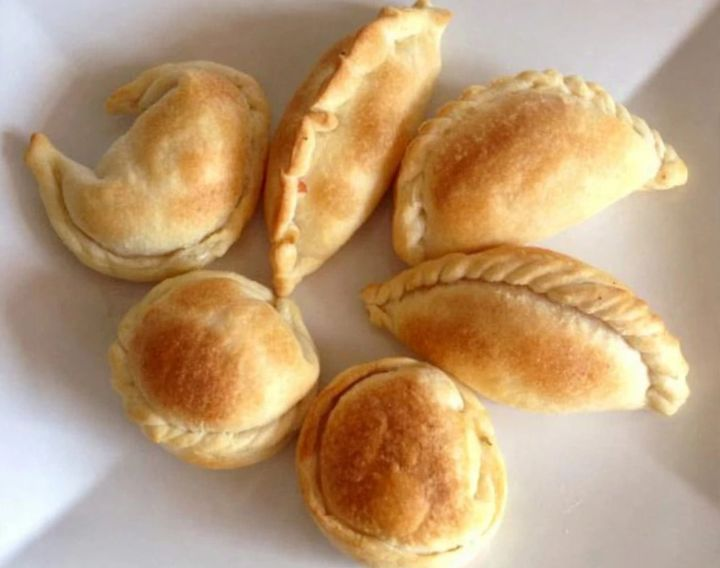
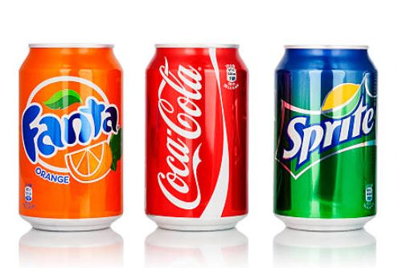

<html lang="es">
<head>
<meta charset="UTF-8">
<meta name="viewport" content="width=device-width, initial-scale=1.0">
<title>Pizzería Pepe - Pizza a la Piedra</title>

</head>
<body>

<header>
  
  <a href="#menu" class="btn-pedir">PEDIR AHORA</a>
  
☰

</header>

  <a href="#seccion-pizzas" style="color:white; display:block; padding:10px; text-decoration:none;">Pizzas</a>
  <a href="#seccion-empanadas" style="color:white; display:block; padding:10px; text-decoration:none;">Empanadas</a>
  <a href="#seccion-bebidas" style="color:white; display:block; padding:10px; text-decoration:none;">Bebidas</a>
  <a href="https://wa.me/549223XXXXXXX" style="color:#e63946; display:block; padding:10px; text-decoration:none; font-weight:bold;">Pedir por WhatsApp</a>

  <h1>Pizza a la Piedra con Sabor MDQ</h1>
  
Y queda mejor con una birra bien fría

  <a href="#menu" class="btn-rojo">PEDIR AHORA</a>

  <h1>¿QUÉ TENÉS GANAS?</h1>

  <a href="#seccion-pizzas" style="text-decoration:none; color:black;">
    

      

        <h2>PIZZAS</h2>
        
Clásicas y especiales hechas en horno a leña

      

      
    

  </a>

  <a href="#seccion-empanadas" style="text-decoration:none; color:black;">
    

      

        <h2>EMPANADAS</h2>
        
Para picar y compartir entre todos

      

      
    

  </a>

  <a href="#seccion-bebidas" style="text-decoration:none; color:black;">
    

      

        <h2>BEBIDAS</h2>
        
Frías y listas para acompañar tu pizza

      

      
    

  </a>

<!-- SECCIONES -->

  <h2 style="text-align:center; color:#e63946; font-size:32px;">PIZZAS A ELECCIÓN</h2>
  
  

    

      <h2>PIZZA NAPOLITANA</h2>
      
Tomate, ajo, orégano y mucho queso. Clásica italiana

      
$8500

    

    
  

  

    

      <h2>MUZZARELLA</h2>
      
La de siempre. Mucho queso y aceitunas

      
$8000

    

    
  

  <h2 style="text-align:center; color:#e63946; font-size:32px;">EMPANADAS</h2>
  
  

    

      <h2>EMPANADAS HORNO</h2>
      
Carne, pollo, jamón y queso. La docena

      
$12000 la docena

    

    
  

  <h2 style="text-align:center; color:#e63946; font-size:32px;">BEBIDAS BIEN FRÍAS</h2>
  
  

    

      <h2>GASEOSAS 500ml</h2>
      
Coca, Fanta, Sprite

      
$2500 c/u

    

    
  

</body>
</html>
