<html lang="es">
<head>
<meta charset="UTF-8">
<meta name="viewport" content="width=device-width, initial-scale=1.0">
<title>Pizzería Pepe - Pizza a la Piedra</title>

</head>
<body>

<header>
  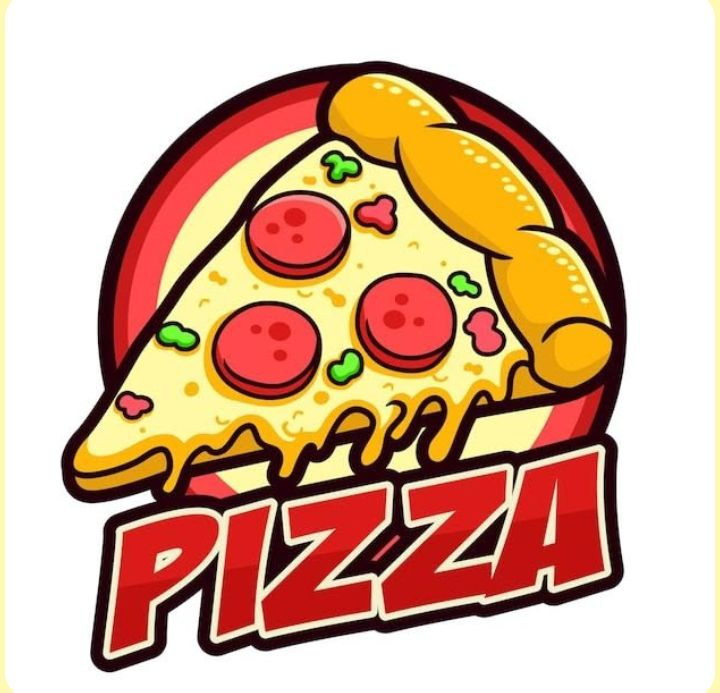
  <a href="#menu" class="btn-pedir">PEDIR AHORA</a>
  
☰

</header>

  <a href="#seccion-pizzas" style="color:#000; display:block; padding:10px; text-decoration:none;">Pizzas</a>
  <a href="#seccion-empanadas" style="color:#000; display:block; padding:10px; text-decoration:none;">Empanadas</a>
  <a href="#seccion-bebidas" style="color:#000; display:block; padding:10px; text-decoration:none;">Bebidas</a>
  <a href="#contacto" style="color:#000; display:block; padding:10px; text-decoration:none;">Ubicación</a>
  <a href="https://wa.me/5491172441030" style="color:#e63946; display:block; padding:10px; text-decoration:none; font-weight:bold;">Pedir por WhatsApp</a>

  <h1>Pizza a la Piedra Hecha con Pasión</h1>
  
El mejor sabor de Mar del Plata en Pizza y Empanadas

  <a href="#menu" class="btn-rojo">PEDIR AHORA</a>

  <h1>¿QUÉ TENÉS GANAS?</h1>
  <a href="#seccion-pizzas" style="text-decoration:none; color:black;">

<h2>PIZZAS</h2>
Clásicas y especiales

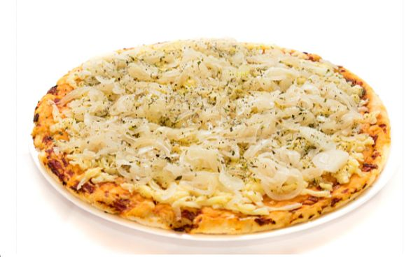
</a>
  <a href="#seccion-empanadas" style="text-decoration:none; color:black;">

<h2>EMPANADAS</h2>
Crujientes y doraditas

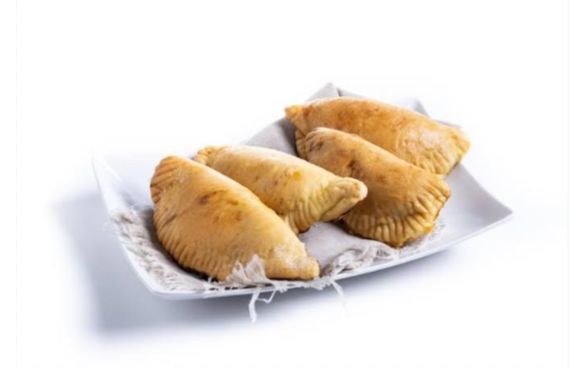
</a>
  <a href="#seccion-bebidas" style="text-decoration:none; color:black;">

<h2>BEBIDAS</h2>
Bien frías

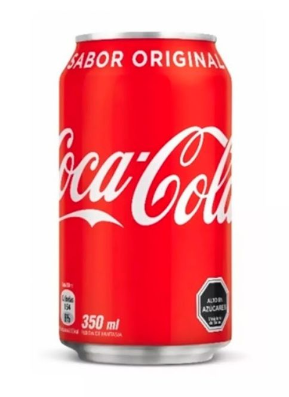
</a>

<!-- PIZZAS -->

  <h2 style="text-align:center; color:#e63946; font-size:32px;">PIZZAS A ELECCIÓN</h2>
  

<h3>MUZZARELLA</h3>
Mucho queso y aceitunas

$8000

<a href="https://wa.me/5491172441030?text=Hola!%20Quiero%201%20Muzzarella%20$8000" class="btn-wsp">Pedir</a>

  
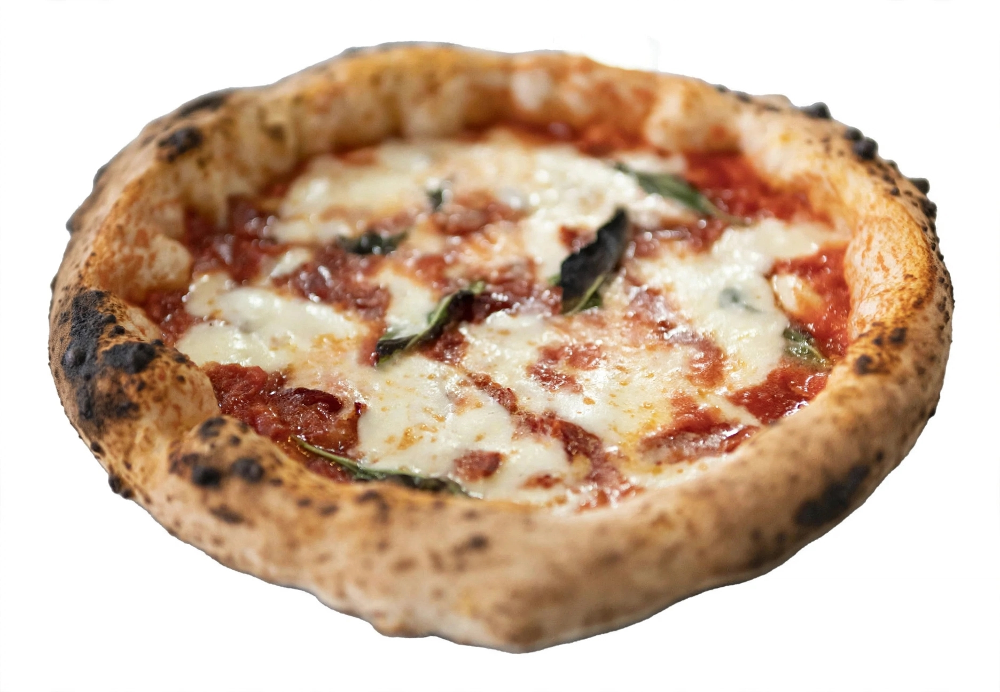
<h3>NAPOLITANA</h3>
Tomate, ajo, orégano y mucho queso

$8500

<a href="https://wa.me/5491172441030?text=Hola!%20Quiero%201%20Napolitana%20$8500" class="btn-wsp">Pedir</a>

  
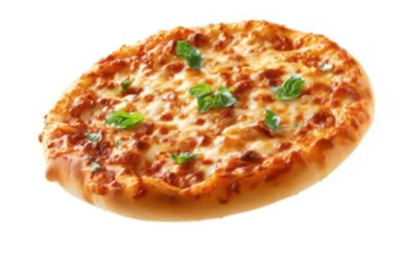
<h3>FUGAZZETA</h3>
Cebolla, queso y orégano

$8200

<a href="https://wa.me/5491172441030?text=Hola!%20Quiero%201%20Fugazzeta%20$8200" class="btn-wsp">Pedir</a>

  
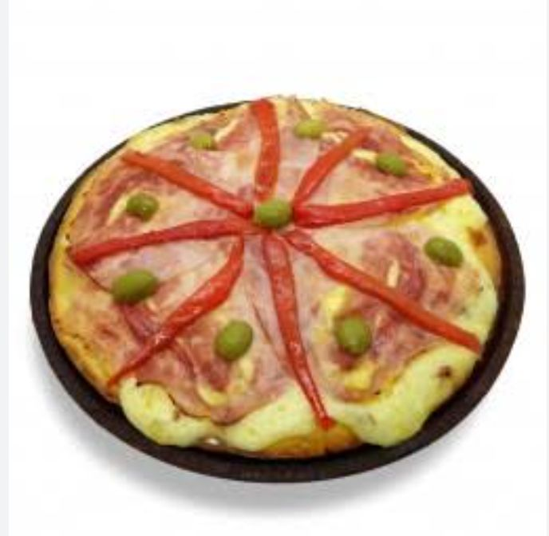
<h3>JAMÓN Y MORRONES</h3>
Jamón cocido, morrones y queso

$8700

<a href="https://wa.me/5491172441030?text=Hola!%20Quiero%201%20Jamón%20y%20Morrones%20$8700" class="btn-wsp">Pedir</a>

<!-- EMPANADAS -->

  <h2 style="text-align:center; color:#e63946; font-size:32px;">EMPANADAS</h2>
  

<h3>EMPANADA CRIOLLA</h3>
Carne cortada a cuchillo

$1000 c/u

<a href="https://wa.me/5491172441030?text=Hola!%20Quiero%201%20Empanada%20Criolla%20$1000" class="btn-wsp">Pedir</a>

  
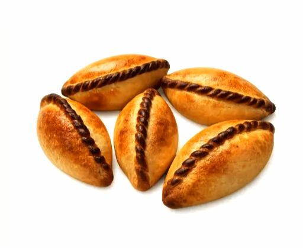
<h3>EMPANADA SALTEÑA</h3>
Carne, papa y huevo. Estilo norte

$1000 c/u

<a href="https://wa.me/5491172441030?text=Hola!%20Quiero%201%20Empanada%20Salteña%20$1000" class="btn-wsp">Pedir</a>

  
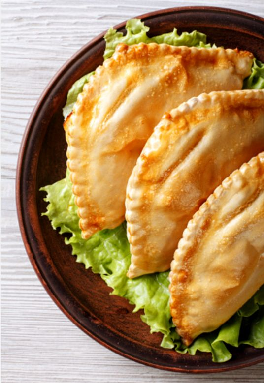
<h3>DOCENA HORNO</h3>
Mezcladas: carne, pollo, jyq

$12000 la docena

<a href="https://wa.me/5491172441030?text=Hola!%20Quiero%201%20Docena%20de%20Empanadas%20$12000" class="btn-wsp">Pedir</a>

<!-- BEBIDAS -->

  <h2 style="text-align:center; color:#e63946; font-size:32px;">BEBIDAS BIEN FRÍAS</h2>
  

<h3>COCA-COLA 350ml</h3>
Sabor original

$2500 c/u

<a href="https://wa.me/5491172441030?text=Hola!%20Quiero%201%20Coca-Cola%20$2500" class="btn-wsp">Pedir</a>

  
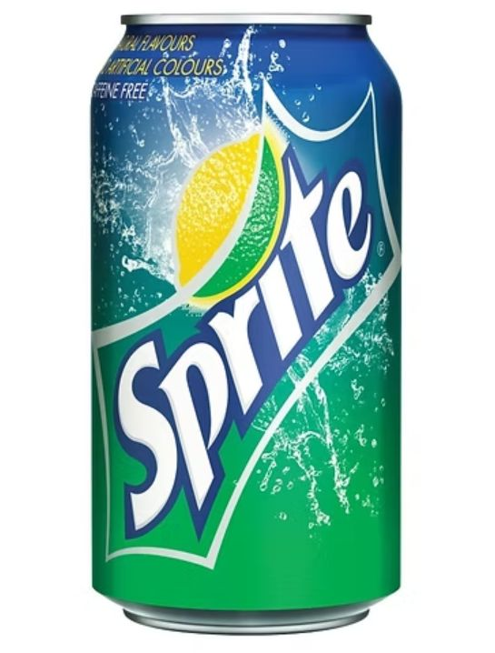
<h3>SPRITE 350ml</h3>
Lima-limón

$2500 c/u

<a href="https://wa.me/5491172441030?text=Hola!%20Quiero%201%20Sprite%20$2500" class="btn-wsp">Pedir</a>

  
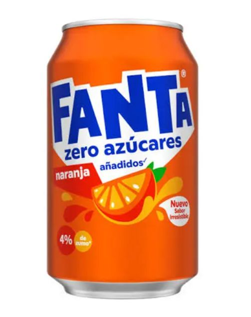
<h3>FANTA NARANJA 350ml</h3>
Zero azúcares

$2500 c/u

<a href="https://wa.me/5491172441030?text=Hola!%20Quiero%201%20Fanta%20$2500" class="btn-wsp">Pedir</a>

  
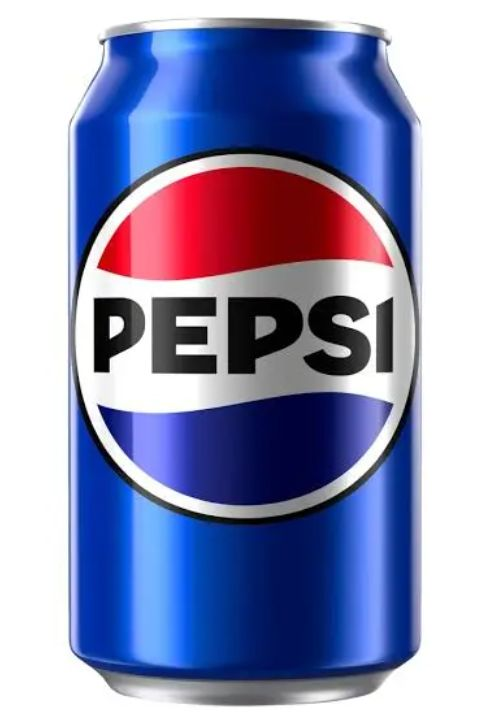
<h3>PEPSI 350ml</h3>
Clásica

$2500 c/u

<a href="https://wa.me/5491172441030?text=Hola!%20Quiero%201%20Pepsi%20$2500" class="btn-wsp">Pedir</a>

  
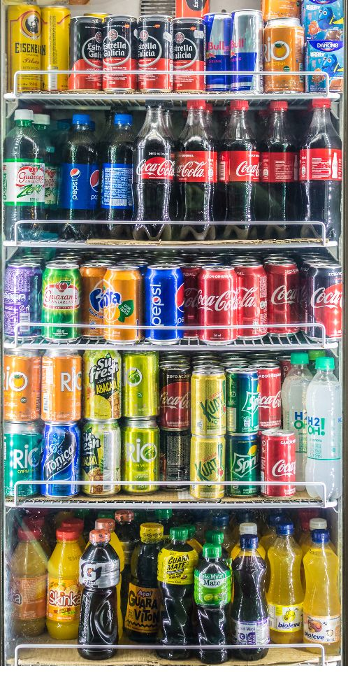
<h3>CERVEZA 473ml</h3>
Quilmes, Brahma, Andes

$3500 c/u

<a href="https://wa.me/5491172441030?text=Hola!%20Quiero%201%20Cerveza%20$3500" class="btn-wsp">Pedir</a>

<!-- CONTACTO -->

  <h2>NUESTRA UBICACIÓN</h2>
  
<b>Horario:</b> Lunes a Domingo de 19:00 a 00:00 hs

  
<b>Dirección:</b> Moreno, Buenos Aires, Argentina

  
<b>Tel:</b> 11 7244-1030

  <iframe src="https://www.google.com/maps/embed?pb=!1m18!1m12!1m3!1d26246.5!2d-58.7916!3d-34.6536!2m3!1f0!2f0!3f0!3m2!1i1024!2i768!4f13.1!3m3!1m2!1s0x95bc9549f7b9b3e9%3A0x5e7b3b3b3b3b3b3b!2sMoreno%2C%20Provincia%20de%20Buenos%20Aires!5e0!3m2!1ses!2sar!4v1234567890" allowfullscreen="" loading="lazy"></iframe>

</body>
</html>
