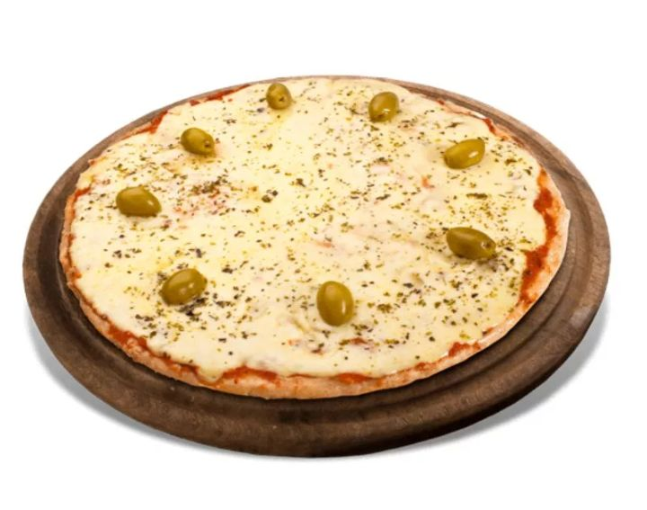

<html lang="es">
<head>
<meta charset="UTF-8">
<meta name="viewport" content="width=device-width, initial-scale=1.0">
<title>Pizzería MDQ</title>

</head>
<body>

<header>
  
  <a href="#menu" class="btn-pedir">PEDIR AHORA</a>
  
☰

</header>

  <h1>Pizza a la Piedra con Sabor MDQ</h1>
  
Y queda mejor con una birra bien fría

  <a href="#menu" class="btn-rojo">PEDIR AHORA</a>

  <h1 style="text-align:center; color:#000;">¿QUÉ TENÉS GANAS?</h1>

  

    

      <h2>PIZZA NAPOLITANA</h2>
      
Tomate, ajo, orégano y queso. Clásica italiana

      
$8500

    

    
  

  

    

      <h2>MUZZARELLA</h2>
      
La de siempre. Mucho queso y aceitunas

      
$8000

    

    
  

  

    

      <h2>BEBIDAS</h2>
      
Gaseosas, agua y birras bien frías

      
$2500

    

    
  

</body>
</html>
